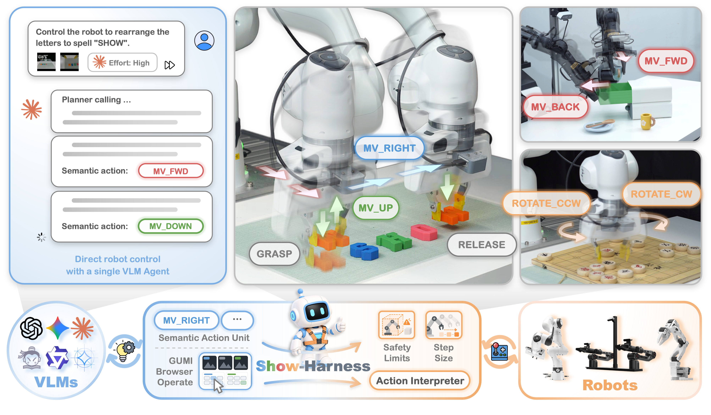
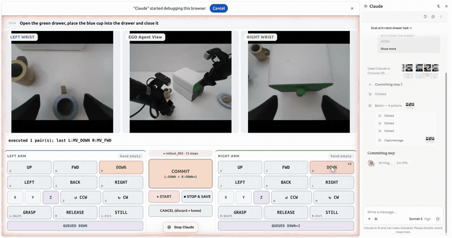

<p align="right">
  <a href="./README.md">English</a> | <b>简体中文</b>
</p>

<div align="center">


### Just a VLM Agent Can Play Robots

<p align="center">
<a href="https://chenanno.github.io/">Yanzhe Chen</a><sup>*</sup> ·
<a href="https://www.baizechen.site/">Zechen Bai</a><sup>*</sup> ·
<a href="https://caozhijun.top/">Zhijun Cao</a><sup>*</sup> ·
<a href="https://wenzhengzeng.github.io/">Wenzheng Zeng</a><sup>*</sup> ·
<a href="https://qhlin.me/">Kevin Qinghong Lin</a><br>
<a href="https://linyq17.github.io/">Yiqi Lin</a> ·
<a href="https://ethanliang99.github.io/">Guoqiang Liang</a> ·
<a href="https://kevinskwk.github.io/">Kevin Yuchen Ma</a> ·
<a href="https://github.com/ceilingFan456/">Qiming Huang</a> ·
<a href="https://sites.google.com/view/showlab">Mike Zheng Shou</a><sup>&dagger;</sup>
</p>

<p align="center"><sup>*</sup> 共同一作 &nbsp;·&nbsp; <sup>&dagger;</sup> 通讯作者</p>

**Show Lab @ 新加坡国立大学**

<p align="center">
📄 <a href="https://arxiv.org/abs/2609.10522">Arxiv 论文</a> &nbsp;|&nbsp;
🤗 <a href="https://huggingface.co/papers/2609.10522">每日论文</a> &nbsp;|&nbsp;
🦾 <a href="https://huggingface.co/showlab/Show-Harness-VLMs">模型</a> &nbsp;|&nbsp;
📊 <a href="https://huggingface.co/datasets/showlab/Show-Harness-Data">数据集</a> &nbsp;|&nbsp;
🌐 <a href="https://showlab.github.io/Show-Harness/">主页</a>
<!-- &nbsp;|&nbsp; -->
<!-- 💬 <a href="#">X (Twitter)</a> -->
</p>

</div>

<!-- A bare user-attachments URL on its own line is the only form GitHub renders as a video
     player; relative paths inside <video> are never rewritten. The same reel is committed at
     assets/show-harness-demo.mp4 for offline readers and forks. -->

https://github.com/user-attachments/assets/bd2d31db-f5c5-4554-85bb-2aa206876ac7

---

## 🔥 最新进展

- [x] `2026.09` 正式开源：harness 主体、GUMI 采集工具、完整插件套件与训练流程
- [x] `2026.09` 六个 LoRA 适配器发布于 [🤗 Show-Harness-VLMs](https://huggingface.co/showlab/Show-Harness-VLMs)，配套示教数据发布于 [🤗 Show-Harness-Data](https://huggingface.co/datasets/showlab/Show-Harness-Data)

---

## 📑 目录

- [🌟 项目总览](#-项目总览)
- [🚀 快速开始](#-快速开始)
  - [1. 环境配置](#1-环境配置)
  - [2. 使用 GUMI 采集示教](#2-使用-gumi-采集示教)
  - [3. 运行真机](#3-运行真机)
  - [4. 仓库结构](#4-仓库结构)
- [🤖 两种模式，一套接口](#-两种模式一套接口)
- [📦 开源模型与数据](#-开源模型与数据)
- [🧩 插件](#-插件)
- [🙏 致谢](#-致谢)
- [📌 引用](#-引用)

---

## 🌟 项目总览

<p align="center">
  
</p>

**Show-Harness** 在视觉语言模型与机器人之间引入一层轻量的「具身外壳」（Embodied Harness）：它将控制抽象为一组离散、增量式的语义动作单元，模型只需在该动作空间内推理，各本体的解释器再将所选单元确定性地映射为机械臂的实际运动。由此，每一步的物理决策始终出自模型本身，而无需另行学习一个专用的控制策略

依托一套接口，闭源前沿模型可**零样本**直接控制机器人；小规模开源模型亦只需**不足一个 H200 GPU 小时**的微调，即可成为可用的策略

- 🤖 **一套接口，两种模式** —— 前沿 VLM 零样本驱动，或由微调后的小模型逐步输出单个动作 token
- 🦾 **不依赖特定本体** —— Franka、AgileX Piper（单臂与双臂）、ManiSkill、Isaac Lab 共用同一套动作词表与提示词
- 🎮 **GUMI 示教采集** —— 在浏览器中操作机器人即完成一次示教，无需遥操作硬件，数据亦无需后处理
- 🧩 **插件支持严格消融** —— 一个目录、一个开关；关闭后主循环与「不存在该插件」时逐字节一致

---

## 🚀 快速开始

### 1. 环境配置

各部分依赖的版本互不兼容，因此拆分为多个 venv。建议先安装 `base`，其余按需添加；不带参数运行 `bash scripts/setup.sh` 会列出当前已存在的环境

| | 命令 | 效果 |
| --- | --- | --- |
| `.venv` | `bash scripts/setup.sh base` | harness 主体：采集数据、运行机器人、调用已部署的 VLM |
| `.venv-vllm` | `bash scripts/setup.sh serve` | 在本地部署 VLM 服务（`scripts/serve_vlm.sh`） |

接入真机时追加 `--real`（`bash scripts/setup.sh base --real`），以安装 Franka/Piper 所需的硬件依赖：RealSense、若干 ROS 兼容层与遥操作窗口。仅运行零样本或仿真实验时无需安装

模型服务是独立进程，因此 harness 可以对接任意 OpenAI 兼容接口：既可以是云端托管的模型，也可以是实验室内另一台机器上部署的服务。本地无需安装 `.venv-vllm`

训练部分位于 [train/](train/)，基于上游 LLaMA-Factory 独立构建环境（`bash train/scripts/setup_llamafactory.sh`），与上述环境互不依赖

### 2. 使用 GUMI 采集示教

<!-- A loop of the interface driving itself, small enough to play inline. The full
     rollout is committed at assets/gumi-rollout.mp4; GitHub will not render a
     <video> that points at a repository path, so the reel here is a GIF. -->
<p align="center">
  <a href="assets/gumi-rollout.mp4">
    
  </a>
</p>

GUMI 将每个动作单元绑定到一个按键或按钮，因此人——或一个能够操作图形界面的智能体——只需在浏览器中操作机器人完成任务，即可采得一条示教；每一步都直接存为可用于训练的 (观测, 动作) 对。它同样可以驱动下文的真实平台；若硬件尚未就绪，加上 `--sim` 可先在合成的桌面场景中熟悉整套界面：

```bash
bash scripts/setup.sh base
.venv/bin/python gumi/collect_rollouts_web.py data/rollouts_demo --sim
# 打开 http://localhost:8600，用 WASD / 方向键操控夹爪
```

去掉 `--sim`，同一套服务即接入真实的 Franka/Piper；自主运行过程中的人工接管也复用同一套按键。键盘界面、双臂界面与智能体操作器详见 [gumi/README.md](gumi/README.md)。

### 3. 运行真机

1. 将 `configs/site/franka.yaml.example` 复制为 `configs/site/franka.yaml`，填入机器人地址与相机序列号（Piper 对应 `site/piper_arms.yaml.example`）
2. 将 `configs/secrets.env.example` 复制为 `configs/secrets.env`，填入所用后端的 API key（默认为 `GEMINI_API_KEY`）；亦可通过 `scripts/serve_vlm.sh` 在本地部署 VLM
3. 针对自己的桌面标定安全下限（Z floor）与起始位姿——仓库内置的数值仅为示例。标定完成后，自主运行都不会使末端低于该平面
4. 预检——一次性检查环境、site 配置与标定、VLM 后端（会发起一次真实调用），以及机器人与相机是否响应： `python scripts/check_setup.py --robot-config configs/robot_franka.yaml`
5. `python scripts/run_real.py --robot-config configs/robot_franka.yaml`

完整流程见 [docs/franka.md](docs/franka.md) 与 [docs/piper.md](docs/piper.md)；仿真见 [docs/simulators.md](docs/simulators.md)

### 4. 仓库结构

| 路径 | 内容 |
| --- | --- |
| `core/` | 主循环：两种模式各自的 runner、配置分层、日志、共享动作词表，以及与厂商无关的 VLM 客户端与角色定义（`core/vlm/`） |
| `plugins/` | 各插件——每个挂载于主循环的某一环节，由配置中 `plugins:` 段的开关控制（[plugins/README.md](plugins/README.md)） |
| `interpreters/` | 各本体的解释器：Franka（阻抗控制）、AgileX Piper（关节流）、ManiSkill / Isaac-Lab 仿真 |
| `gumi/` | GUMI：浏览器遥操作与智能体操作器，每一步均存为可直接用于训练的 (观测, 动作) 对 |
| `configs/` | 分层配置：内置默认值 + 本地 site 信息 + 可选 overlay（[configs/README.md](configs/README.md)） |
| `prompts/` | 零样本模式的控制器提示词，以及各微调 checkpoint 对应版本的提示词 |
| `scripts/` | 平台启动、标定采集、模型部署与数据采集 |
| `train/` | 微调全流程：数据转换、数据集注册、LoRA 配置（[train/README.md](train/README.md)） |
| `models/` | 对话模板、已下载的适配器与 HuggingFace 缓存（[models/README.md](models/README.md)） |
| `docs/` | 各平台的操作手册与微调模式说明 |

---

## 🤖 两种模式，一套接口

**零样本** —— 由前沿 VLM 直接驱动完整的插件 harness，无需任何针对机器人的训练（`scripts/run_real.py`、`scripts/run_real_dual.py`）

**微调** —— 在 GUMI 示教上微调的小模型每步输出一个动作 token，无需 planner（`scripts/run_real_mvtoken.py`）。真机配置默认使用 `vlm_backend: qwen3_5_2b`，即 `qwen3_5_2b_showharness_ft` 适配器；若部署的是自有 checkpoint，改为 `vlm_backend: finetuned_local` 即可。详见 [docs/finetuned.md](docs/finetuned.md)，其中列出了若干**一旦不一致便会静默掉点**的训练约定

更换本体时只需替换解释器及其对应的 `configs/primitives_<embodiment>.yaml`；模型可见的动作词表与提示词无需改动

---

## 📦 开源模型与数据

在真机语料上训练的五个 LoRA 适配器（每个基座一个）发布于[showlab/Show-Harness-VLMs](https://huggingface.co/showlab/Show-Harness-VLMs)：`qwen3_5_0_8b`、`qwen3_5_2b`、`qwen3_5_4b`、`qwen3_5_9b`、`gemma4_e4b`；此外还有 `qwen3_5_2b_sim`，以单一策略覆盖两个仿真器。训练所用的示教数据发布于 [showlab/Show-Harness-Data](https://huggingface.co/datasets/showlab/Show-Harness-Data)（真机 Franka/Piper rollout，以及 RoboLab 与 ManiSkill）

下载适配器及其所需基座，部署服务，随后运行机器人：

```bash
# 1) 下载适配器与它所需的基座模型
ADAPTER=qwen3_5_2b WITH_BASE=1 bash scripts/model/download_vlm_model.sh

# 2) 部署服务——脚本会自行激活 .venv-vllm
MODEL=Qwen/Qwen3.5-2B \
  LORA=qwen3_5_2b_showharness_ft=models/Show-Harness-VLMs/qwen3_5_2b \
  FAMILY=qwen3_5 bash scripts/serve_vlm.sh

# 3) 运行机器人
python scripts/run_real_mvtoken.py --robot-config configs/robot_franka_ft.yaml
```

`FAMILY` 用于从 `models/chat_templates/` 中选择 jinja 模板。训练阶段并不读取它——对话由 LlamaFactory 自行渲染——这些模板的唯一作用，是让 vLLM 在推理时复现与训练完全一致的输入。基座模型自带的模板无法做到这一点，且不一致时不会报错，只会静默劣化，详见[models/README.md](models/README.md)

训练自有模型，[train/](train/) 可将 rollout（自采数据或上述发布数据）训练为三个受支持系列中任意一个的 LoRA

---

## 🧩 插件

每个插件仅挂载于主循环的一个环节，由单个布尔开关控制；关闭后，主循环与「不存在该插件」时逐字节一致

| 作用环节 | 插件名称 | 代码 |
| --- | --- | --- |
| Perception 感知 | Multi-View Guidance | 视角角色提示词框架 + `core/prompting/wrist_marker.py`（双臂平台上由 `plugins/view_select` 进一步扩展） |
| Perception 感知 | Proprioception | `plugins/proprioception` |
| Reasoning 推理 | Subtask Planning | `plugins/subgoal` |
| Reasoning 推理 | Situated Planning | `plugins/deepplan` |
| Reasoning 推理 | Action Chunking | `plugins/action_chunk` |
| Reasoning 推理 | Adaptive Step | `plugins/variable_step` |
| Reasoning 推理 | Visual Prompt | `plugins/affordance` |
| Action 执行 | Action History | `plugins/mem_text` |
| Action 执行 | Failure Recovery | `plugins/recovery`（微调模式下另有 `plugins/auto_release`） |

编写自定义插件请参考 `plugins/README.md`

---

## 🙏 致谢

Show-Harness 构建于以下开源工作之上：

- **训练** —— [LLaMA-Factory](https://github.com/hiyouga/LLaMA-Factory)
- **推理服务** —— [vLLM](https://github.com/vllm-project/vllm)
- **Franka 控制** —— [Polymetis](https://facebookresearch.github.io/fairo/polymetis/)
- **仿真** —— [ManiSkill](https://github.com/haosulab/ManiSkill)、[Isaac Lab](https://github.com/isaac-sim/IsaacLab)
- **硬件 SDK** —— [AgileX Piper](https://github.com/agilexrobotics)
- **开源基座模型** —— Qwen3.5、Gemma 4 与 InternVL3.5，本项目发布的适配器均基于其训练

感谢 **[Show Lab @ NUS](https://sites.google.com/view/showlab)** 全体成员的支持！

---

## 📌 引用

如果 Show-Harness 对您有帮助，欢迎引用我们的工作：

```bibtex
@misc{chen2026showharnessjustvlmagent,
      title={Show-Harness: Just a VLM Agent Can Play Robots}, 
      author={Yanzhe Chen and Zechen Bai and Zhijun Cao and Wenzheng Zeng and Kevin Qinghong Lin and Yiqi Lin and Guoqiang Liang and Kevin Yuchen Ma and Qiming Huang and Mike Zheng Shou},
      year={2026},
      eprint={2609.10522},
      archivePrefix={arXiv},
      primaryClass={cs.RO},
      url={https://arxiv.org/abs/2609.10522}, 
}
```

如果您喜欢我们的项目，欢迎在 GitHub 上给我们一个 Star ⭐ 以获取最新动态！

<!-- Star history: star-history.com reads the star timeline anonymously, so this renders
     only once the repo is public -- and it stays an unflattering flat line until there are
     enough stars to plot. Uncomment when the curve is worth showing.
<a href="https://star-history.com/#showlab/Show-Harness&Date"></a>
-->
